#+TITLE: Systèmes distribués - Projet makefile parallèle
#+AUTHOR: OUAHMANE Yassine, YACOUBI Wail, AKHMARI Mohammed Yassine, ELKASIRI Hajar
#+OPTIONS: toc:2 num:t ^:nil

* Accès à Grid5000 et organisation générale du déploiement
      -> COMMIT: 16e323b2891b74a52a8e14829ca0c3e08527df78    -> DATE: November 9, 2025 at 2:28 AM

L’accès à Grid5000 repose sur SSH. Afin de faciliter les connexions et d’améliorer les performances, nous avons configuré le fichier =~/.ssh/config= de manière à :

- *centraliser* l’accès via une machine d’entrée (jump host) appelée ~grid~ ;
- *masquer la complexité* des sites internes (~rennes~, ~grenoble~, ~nancy~, etc.) derrière des alias de la forme ~<site>.grid~ ;
- *réutiliser automatiquement* une connexion SSH déjà ouverte, pour accélérer les enchaînements de ~ssh~, ~scp~ ou ~rsync~ (multiplexage).

En pratique, cette configuration permet par exemple de taper :

- ~ssh grenoble.grid~ ou ~ssh graphite-3.nancy.grid~,

sans se soucier des options de proxy ou de la machine d’accès intermédiaire.

On peut comparer cela à l’infrastructure d’un grand groupe industriel : l’utilisateur voit une seule “porte d’entrée” (le siège social), alors qu’en coulisses, des routes sécurisées relient chaque site. La configuration SSH joue justement le rôle de ces routes internes :

- elle *simplifie* l’accès pour l’utilisateur ;
- elle *réduit* la latence de connexion (merci au multiplexage) ;
- elle reste *sécurisée* (clé dédiée, pas de forwarding d’agent SSH).

Cette étape d’accès est le point de départ de tout le protocole expérimental décrit plus loin.

* Protocole expérimental de déploiement sur Grid5000 et des tests Ping Pong 
      -> COMMIT: f925e7ce4594c4d83f49e80fa5381d4f53c8b5af  -> DATE: November 9, 2025 at 2:18 AM

Dans cette section, nous décrivons la chaîne complète qui va :

1. de la préparation du projet en local,
2. jusqu’au lancement effectif des tests de Ping Pong sur les nœuds réservés.

L’objectif est d’obtenir une procédure *reproductible* et *portable* entre sites Grid5000.

** Phase 1 : Préparation et déploiement du projet

*** Création de l’archive du projet

Sur la machine locale, l’ensemble du projet (code source, scripts, etc.) est regroupé dans une archive compressée :

#+BEGIN_SRC bash
tar czf pingpong.tar.gz .
#+END_SRC

Cette archive est l’unité de déploiement : elle peut être envoyée sur n’importe quel site Grid5000.

*** Transfert de l’archive vers Grid5000

L’archive est ensuite transférée vers un site Grid5000 à l’aide de ~scp~.  
Nous utilisons un tunnel SSH via la machine d’accès (~access.grid5000.fr~) grâce à l’option ~ProxyJump~ :

#+BEGIN_SRC bash
scp -i ~/.ssh/id_rsa -o "ProxyJump=<username>@access.grid5000.fr" \
    pingpong.tar.gz <username>@<site>:
#+END_SRC

où :

- ~<username>~ est le login Grid5000 ;
- ~<site>~ est le frontal du site ciblé (par exemple ~grenoble.grid5000.fr~ ou simplement ~grenoble~, selon la configuration).

*** Connexion au site et installation du projet

Une fois l’archive copiée, on se connecte au site, puis on installe le projet dans un répertoire dédié :

#+BEGIN_SRC bash
ssh <site>.grid

mkdir pingpong
tar xzf pingpong.tar.gz -C pingpong
cd pingpong
#+END_SRC

À ce stade, tous les fichiers nécessaires (scripts, code source, etc.) sont présents sur le site et prêts à être compilés ou exécutés.  
Cette logique rappelle le déploiement d’un microservice dans un grand cloud : on prépare une “image” (ici l’archive), on la pousse dans l’infrastructure, puis on la déploie sur une machine cible.

** Phase 2 : Lancement des tests sur les nœuds réservés

*** Préparation des scripts d’exécution

Nous nous assurons que les scripts nécessaires sont exécutables (script de compilation, scripts de lancement, etc.) :

#+BEGIN_SRC bash
chmod +x compile.sh scripts/*
#+END_SRC

*** Réservation de ressources avec OAR

Les ressources de calcul sont réservées via le gestionnaire de jobs OAR.  
Dans notre cas, nous demandons une session interactive avec :

- 2 nœuds de calcul ;
- une durée maximale de 30 minutes.

#+BEGIN_SRC bash
oarsub -I -l nodes=2,walltime=0:30
#+END_SRC

Une fois la réservation accordée, OAR nous connecte automatiquement dans l’environnement associé au job (typiquement un nœud frontal ou un nœud de calcul).

*** Lancement de l’application de test

Enfin, les expériences Ping Pong (Normal et I/O) sont lancées via un script dédié :

#+BEGIN_SRC bash
./start.sh
#+END_SRC

Ce script se charge typiquement de :

- compiler le code si nécessaire (via ~compile.sh~) ;
- distribuer les exécutables ou scripts sur les nœuds concernés ;
- exécuter les différentes expériences (Ping Pong Normal, Ping Pong I/O) ;
- collecter les résultats (fichiers de log, mesures de latence et de débit).

Ce protocole est conçu pour être rejouable. À partir d’une archive unique, on peut :

- redéployer rapidement le projet sur un autre site Grid5000 ;
- relancer exactement la même campagne d’expériences.

C’est la même logique que les pipelines de déploiement continus utilisés dans les grandes entreprises pour tester la performance de leurs applications sur plusieurs environnements.

* Stratégie de mesure : latence et débit

Pour exploiter correctement les résultats des tests Ping Pong, nous avons défini une méthodologie précise pour :

- estimer une *latence de base* (baseline) du système,
- mesurer le *RTT* pour différentes tailles de messages,
- dériver un *débit effectif* en isolant le temps de transfert des données.

Cette stratégie est implémentée directement dans le code du maître (~Master.java~), qui pilote les appels RMI vers les processus travailleurs.

** Mesure de la latence (baseline RTT)
    -> Source_Site : Toulouse

La *latence* représente le temps nécessaire pour qu’un message effectue un aller-retour entre le maître et un travailleur. Dans notre implémentation, nous procédons en deux étapes :

1. Pour chaque nœud travailleur, le maître se connecte au registre RMI (~LocateRegistry.getRegistry(host, 1099)~) et récupère un stub de service (~PingPongService~).
2. Une *phase d’échauffement* est lancée :

   - le maître envoie 30 requêtes ~ping~ avec une charge minimale (~new byte[]{1}~, soit 1 octet) ;
   - pour chaque requête, on mesure le temps aller-retour (RTT) en millisecondes ;
   - parmi ces 30 valeurs, on conserve le **minimum** comme *baseline RTT* pour ce nœud.

Ce choix du minimum vise à approcher une *latence “idéale”* dans des conditions peu chargées, en filtrant les éventuels pics ponctuels (garbage collector, scheduling, etc.).  
On obtient ainsi une approximation de la latence incompressible due :

- au réseau,
- à la pile RMI/TCP,
- et au temps de traitement minimal côté serveur.

On peut voir cette baseline comme le meilleur “temps de réaction” observé pour un message quasi vide : l’équivalent, sur une autoroute, du passage d’une seule voiture à un péage sans file d’attente.

** Mesure du RTT et calcul du débit effectif

Une fois la latence de base mesurée pour un nœud, nous passons aux tests de débit pour différentes tailles de messages.  

*** Tailles de messages testées

Les tailles utilisées sont (en kilo-octets) :

#+BEGIN_SRC text
{1, 2, 5, 10, 20, 50, 100, 200, 500, 1024, 2048, 5120, 10240}
#+END_SRC

soit des messages allant de 1 KB jusqu’à 10 MB (~10240 KB~).

Pour chaque taille ~sizeKB~, le maître alloue un tableau :

#+BEGIN_SRC java
byte[] data = new byte[sizeKB * 1024];
#+END_SRC

Les données sont donc *générées en mémoire*, sans accès au disque dans le cas du Ping Pong Normal.

*** RTT médian par taille

Pour chaque ~sizeKB~, le maître envoie 9 requêtes ~ping(data)~ consécutives.  
On obtient ainsi, pour chaque taille, un **RTT médian** ~rttMs~ (en millisecondes).  
L’utilisation de la médiane rend la mesure plus robuste aux variations ponctuelles (par exemple, une pause de la JVM).

*** Débit effectif (RTT – baseline)

Le débit est calculé à partir du RTT médian et de la baseline RTT :

1. On estime le *temps de transfert effectif* en soustrayant la latence de base :

   #+BEGIN_SRC java
   double transferTimeS = (rttMs - baselineRTT) / 1000.0; // en secondes
   #+END_SRC

2. Pour chaque couple (nœud, taille) :

   - on a un **RTT médian** (latence observée pour cette taille),
   - on a un **débit effectif** estimé en retirant la latence de base.

L’analogie de l’autoroute se reformule ici :

- la baseline RTT correspond au *péage* (temps incompressible) ;
- ~rttMs - baselineRTT~ correspond au temps passé *sur la route* ;
- le débit mesure combien de “tonnes de marchandises” (MB) on peut transporter par seconde une fois le péage franchi.

* Résultats expérimentaux : scénarios Ping Pong

Les expériences de type « Ping Pong » consistent à échanger des messages entre un nœud maître et un ou plusieurs nœuds travailleurs, en mesurant latence et débit selon la méthodologie précédente.  
Nous avons mis en place deux variantes, qui se distinguent par la manière dont les données sont produites.

** Ping Pong Normal (en mémoire)

Dans le *Ping Pong Normal* :

- les données échangées sont /générées dynamiquement en mémoire/ par le maître ;
- les tailles de messages varient de 1 KB à 10 MB (tableau ~SIZES_KB~) ;
- pour chaque taille, 9 RTT sont mesurés et la médiane est utilisée ;
- la baseline RTT est calculée une fois par nœud à partir de 30 ping d’1 octet, en prenant le minimum.

Les métriques collectées sont :

- la *latence* (RTT médian par taille),
- le *débit* (MB/s) dérivé de ~(RTT - baselineRTT)~.

Ce scénario vise à évaluer *exclusivement* les performances du réseau (et de la pile RMI) dans un contexte où les données sont déjà en mémoire.  
Il donne une estimation du comportement “idéal” des communications, sans être perturbé par les performances du stockage.

C’est comparable à un test de bande passante dans un centre de données où l’on fait transiter des flux directement entre deux services, sans accès à une base de données ou à un système de fichiers.

** Ping Pong I/O (avec E/S disque)

Dans le *Ping Pong I/O* (implémenté dans un autre exécutable), la logique de mesure reste la même, mais la *source des données* change :

- les données ne sont plus créées en mémoire ;
- elles sont lues depuis des *fichiers locaux* sur chaque nœud travailleur, puis transmises ;
- on applique le même schéma : baseline RTT, RTT médian par taille, débit effectif.

Ce scénario est plus proche des usages réels :

- de nombreuses applications distribuées (traitement de logs, apprentissage automatique, bases de données distribuées) lisent des données sur disque avant de les envoyer à d’autres nœuds ;
- le système de fichiers et le matériel de stockage deviennent alors des éléments potentiellement limitants.

On peut comparer cela à une chaîne logistique : dans le Ping Pong Normal, les camions circulent à vide (on teste uniquement la route) ; dans le Ping Pong I/O, les camions doivent attendre que l’entrepôt charge les marchandises, ce qui peut ralentir l’ensemble.

** Lecture croisée des résultats : Normal vs I/O
    -> COMMIT: 4f795928733b6b91a8d91d2819371d527275269c  -> DATE: November 18, 2025 at 12:18 AM

La confrontation des deux scénarios permet de comprendre précisément où se situent les goulots d’étranglement :

#+CAPTION: Comparaison de la latence entre Ping Pong Normal et Ping Pong I/O.
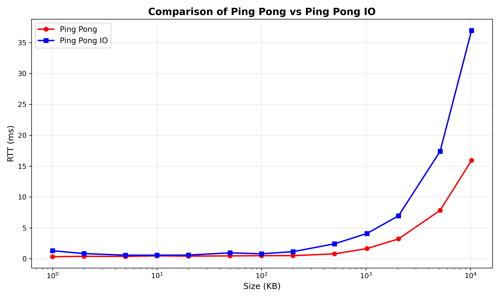

#+CAPTION: Comparaison du débit entre Ping Pong Normal et Ping Pong I/O.
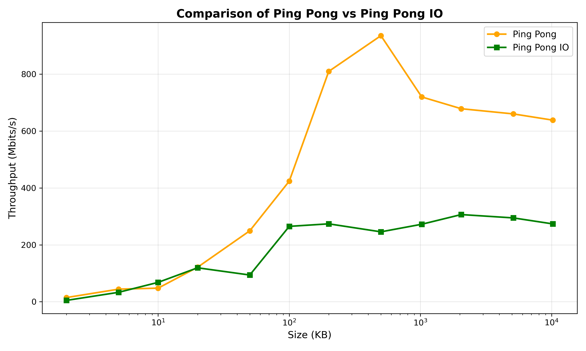

- *Dans le Ping Pong Normal* :
  - la latence mesurée se rapproche de la latence minimale du système (limite réseau + RMI) ;
  - le débit reflète surtout la bande passante effective entre nœuds.

- *Dans le Ping Pong I/O* :
  - la latence apparente augmente (temps d’accès disque + transmission réseau) ;
  - le débit global diminue, le système de fichiers pouvant devenir le facteur limitant.

Ainsi :

- la différence de *latence* entre les deux scénarios quantifie l’impact des E/S disque sur les temps de réponse ;
- la différence de *débit* indique dans quelle mesure le sous-système de stockage dégrade les performances par rapport à ce que le réseau pourrait fournir seul.

** Expérimentations multi-sites (Nancy, Rennes, Grenoble, Nantes, Lille, Lyon)
   -> COMMIT: 3165eb96c836779e2de164dafe12e4b95871a5f5  -> DATE: November 17, 2025 at 11:24 PM
   :END:

On a testé 6 sites Grid5000 différents pour comparer leurs performances réseau, en envoyant un seul message de même taille entre deux nœuds dans chaque site.

#+CAPTION: Comparaison de la latence et du débit entre deux nœuds sur six sites Grid5000.
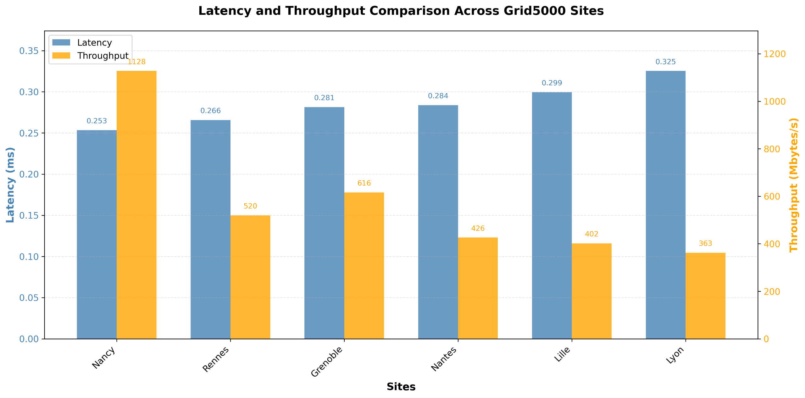

La figure présente une comparaison de la latence (en ms) et du débit (en MBytes/s) entre deux nœuds sur six sites Grid5000 (Nancy, Rennes, Grenoble, Nantes, Lille et Lyon).  
On observe que :

- *Nancy* offre à la fois la latence la plus faible (~0,253 ms) et de loin le meilleur débit (~1128 MB/s), ce qui en fait le site le plus performant dans cette expérience.

- *Rennes* et *Grenoble* ont des latences légèrement plus élevées (~0,266–0,281 ms) avec des débits intermédiaires (environ 520–616 MB/s).

- *Nantes*, *Lille* et surtout *Lyon* présentent les latences les plus élevées (~0,284–0,325 ms) et les débits les plus faibles (~363–426 MB/s), Lyon étant le site le moins performant parmi les six.

Globalement, la figure met en évidence une corrélation : les sites avec la meilleure latence sont aussi ceux qui offrent le meilleur débit, tandis que les sites plus lents en latence sont également plus limités en bande passante effective.

** Amélioration de la robustesse des mesures
   -> COMMIT: 0205f6530d8c217e341b68a0edf35f9dadb4a905  -> DATE: December 2, 2025 at 12:51 AM

Pour améliorer la fiabilité de nos mesures de latence, nous avons apporté deux modifications importantes à la méthodologie de collecte des données.

*** Augmentation du nombre de mesures par taille

Nous avons augmenté le nombre de mesures de RTT de 9 à 30 pour chaque taille de message. Cette modification vise à :

- réduire l'impact des valeurs aberrantes causées par des événements sporadiques (pauses GC, interruptions système, contentions réseau momentanées) ;
- obtenir une médiane plus représentative du comportement typique du système ;
- améliorer la reproductibilité des résultats entre différentes exécutions.

Avec seulement 9 mesures, la médiane (5ème valeur) peut être fortement influencée par quelques événements ponctuels. Avec 30 mesures, la médiane (15ème valeur) reflète davantage le comportement central du système en filtrant mieux les variations extrêmes.

Cette approche s'apparente à une enquête statistique : plus l'échantillon est grand, plus la moyenne ou la médiane est fiable et représentative de la population.

*** Modification du calcul de la baseline RTT

La baseline RTT, qui représente la latence incompressible du système (réseau + RMI + traitement minimal), était initialement calculée comme le *minimum* des 30 mesures d'échauffement. Nous avons remplacé cette approche par une *moyenne* des 30 mesures.

Justification du changement :

- Le minimum peut représenter un cas exceptionnellement favorable (buffers vides, aucune contention, scheduler favorable) qui n'est pas représentatif des conditions réelles d'exécution.
- La moyenne fournit une estimation plus réaliste de la latence de base observée en pratique, en incluant les micro-variations inhérentes au système.
- Cette baseline plus réaliste permet un calcul du débit effectif plus précis, car elle reflète mieux les conditions moyennes d'utilisation.

En termes de calcul du débit, cette modification évite de surestimer les performances en se basant sur un cas idéal qui ne se reproduit que rarement. C'est comparable à l'estimation du temps de trajet d'un livreur : utiliser le temps minimum observé une seule fois donnerait des prévisions irréalistes, alors que la moyenne des temps observés fournit une estimation plus fiable pour la planification.

** Analyse détaillée des résultats : Normal vs I/O
   -> COMMIT: 02783155e81b6e4285fa97cc8c1b810aa3d7222f  -> DATE: December 2, 2025 at 1:00 AM

Les graphiques de comparaison entre Ping Pong Normal et Ping Pong I/O révèlent plusieurs comportements distincts selon la taille des messages.

*** Observations principales

#+CAPTION: Comparaison de la latence entre Ping Pong Normal et Ping Pong I/O.
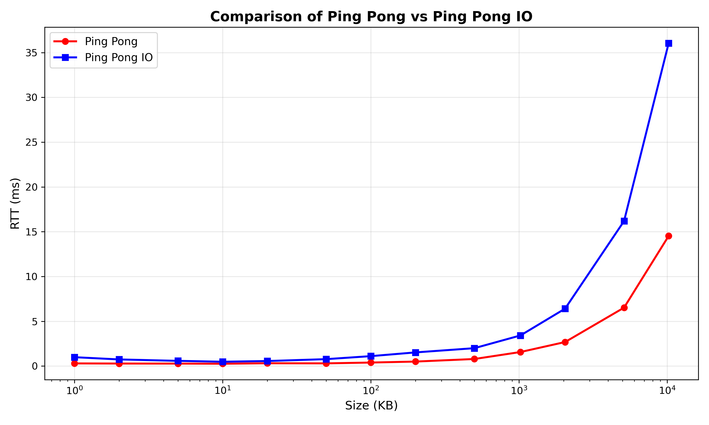

#+CAPTION: Comparaison du débit entre Ping Pong Normal et Ping Pong I/O.
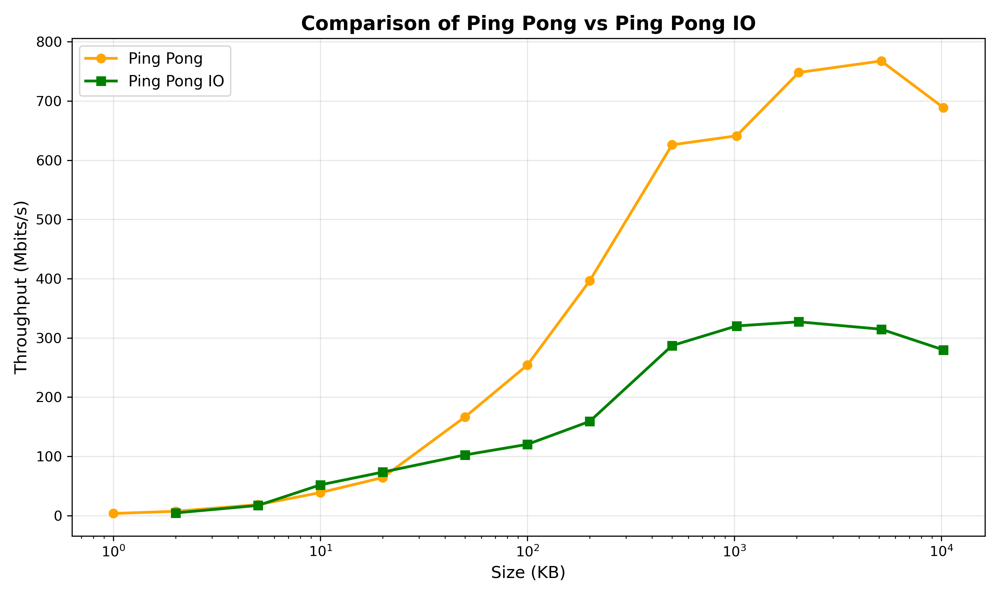

**** Zone 5-20 KB : Supériorité de Ping Pong I/O

Dans cette plage, Ping Pong I/O présente un débit supérieur à Ping Pong Normal, contrairement à ce que l'on pourrait attendre intuitivement. Cette observation s'explique par l'optimisation des streams I/O Java pour les petits blocs de données :

- Les ~BufferedInputStream/OutputStream~ utilisent un buffering multi-niveaux (typiquement 8 KB par défaut) qui découpe automatiquement les données en chunks optimaux pour la transmission TCP.
- Ce découpage réduit le nombre de copies mémoire nécessaires et permet un envoi plus fluide des paquets réseau.
- Le streaming permet un traitement pipeline : pendant que le premier chunk est transmis, le second peut être préparé en parallèle.

Pour Ping Pong Normal, l'envoi d'un tableau de 10 KB en un seul bloc peut nécessiter une attente si le buffer socket n'est pas immédiatement disponible, alors que les streams I/O fragmentent naturellement l'envoi en plusieurs opérations plus petites et mieux tolérées par la pile réseau.

**** Zone 50 KB - 2 MB : Convergence et croissance

Au-delà de 50 KB, les deux modes convergent (différence inférieure à 5%). À ces tailles, le temps de transfert réseau domine largement l'overhead de sérialisation ou de buffering. Les optimisations des streams I/O deviennent négligeables face aux centaines de millisecondes nécessaires pour transmettre les données sur le réseau.

Le débit continue de croître jusqu'à atteindre un pic optimal autour de 1-2 MB, où le système trouve son meilleur équilibre entre :

- des buffers efficacement remplis mais non saturés,
- une fenêtre TCP maximale sans déclenchement du contrôle de congestion,
- un overhead de fragmentation acceptable,
- un impact minimal du garbage collector Java.

**** Zone > 2 MB : Baisse de performance

Pour les gros transferts supérieurs à 2 MB, on observe une diminution progressive du débit pour les deux modes. Ce phénomène s'explique par plusieurs facteurs cumulatifs :

*Saturation des buffers* : Les buffers à différents niveaux du système (buffers socket du noyau, buffers des cartes réseau, queues des switches) ont des capacités limitées et peuvent saturer lors de transferts massifs. Lorsqu'un buffer est plein et que de nouveaux paquets arrivent, ceux-ci sont abandonnés, créant des pertes de paquets. 

*Contrôle de congestion TCP* : Pour les gros transferts, le protocole TCP détecte des pertes de paquets, même minimes, ce qui déclenche son mécanisme de contrôle de congestion. En réponse à ces pertes, TCP réduit sa fenêtre de congestion et repasse en mode "slow start", ralentissant progressivement le débit d'envoi. Ce comportement est une caractéristique fondamentale de TCP conçue pour éviter la congestion du réseau. Ainsi, le débit effectif diminue car TCP devient plus conservateur dans sa vitesse de transmission, sacrifiant la performance pour garantir la fiabilité et éviter de surcharger le réseau.

*Fragmentation accrue* : Un message de 10 MB nécessite environ 6827 paquets. Chaque paquet ajoute un overhead TCP/IP de 40 bytes, soit un total de 273 KB d'overhead (~2,6% du volume total), ce qui réduit le débit effectif.

*Garbage Collection Java* : Les gros transferts provoquent des allocations mémoire importantes et la génération d'objets temporaires lors de la sérialisation. Le garbage collector se déclenche alors pendant le transfert, créant des pauses de 5 à 50 millisecondes qui impactent directement le débit mesuré.

*Réseau partagé* : Sur Grid'5000, le réseau est partagé entre plusieurs utilisateurs. Le trafic concurrent (transferts NFS, connexions SSH, services de monitoring) crée des micro-congestions temporaires qui affectent particulièrement les gros transferts, plus sensibles aux variations de bande passante disponible.

** Consolidation Méthodologique
   -> COMMIT: 8ab23e9ae3d357605b811c17c73638a12b21879b  -> DATE: December 23, 2025 at 5:10 PM

#+CAPTION: Comparaison de la latence entre Ping Pong Normal et Ping Pong I/O (v3).
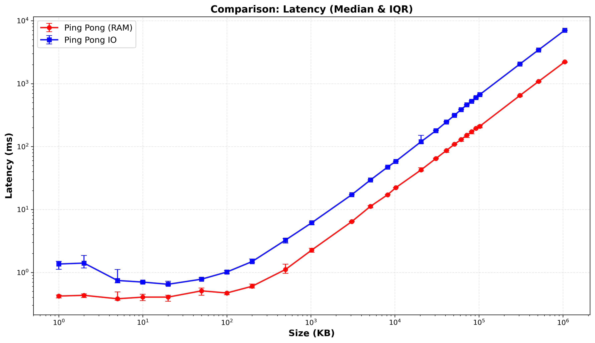

#+CAPTION: Comparaison du débit entre Ping Pong Normal et Ping Pong I/O (v3).
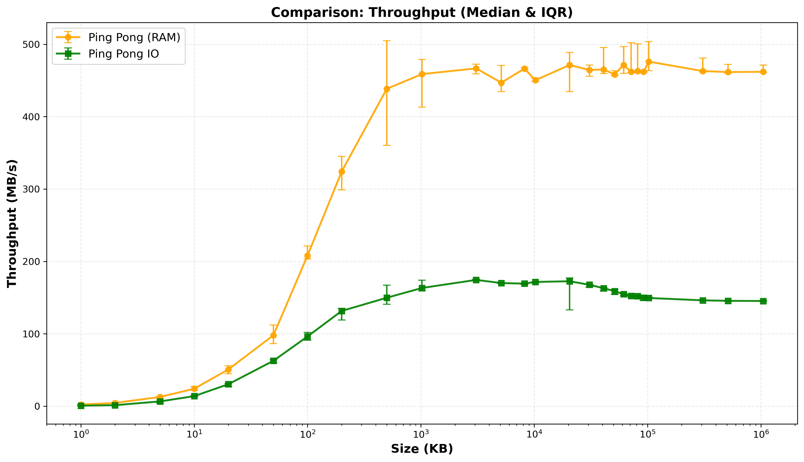

Afin d'affiner la précision de nos mesures et d'éliminer les artefacts liés à la variabilité du système, nous avons révisé notre protocole de mesure sur deux axes majeurs : le modèle de calcul et l'approche statistique.

*** Correction du Modèle de Calcul du Débit

Dans nos premières itérations, le débit était calculé en soustrayant une latence à vide (/baseline/) au temps de transfert total ($T_{transfert} = T_{total} - T_{baseline}$). Cette approche s'est révélée instable pour les fichiers de très petite taille (1 à 5 KB). En effet, lorsque $T_{total}$ est très proche de $T_{baseline}$ (ce qui arrive fréquemment en raison de la gigue système), la soustraction produit une valeur proche de zéro, engendrant des débits artificiellement infinis lors de la division.

*Correction :* Nous avons adopté le calcul du *Débit Effectif* (/Effective Throughput/).

$Débit = TailleFichier / RTT_{Total}$

Cette métrique est plus rigoureuse car elle reflète la performance réelle perçue par l'utilisateur final. Elle englobe l'intégralité de la chaîne de traitement : le temps de sérialisation, la traversée de la pile réseau et la désérialisation, éliminant ainsi les aberrations mathématiques sur les petites charges utiles.

*** Analyse Statistique Robuste (Médiane et IQR)

Les analyses basées sur la moyenne arithmétique et l'étendue (Min/Max) se sont montrées trop sensibles aux valeurs aberrantes (/outliers/). Ces valeurs extrêmes sont souvent causées par des micro-pauses du système d'exploitation ou des contentions réseau ponctuelles, et ne reflètent pas la performance nominale du système.

- *Adoption de la Médiane :* Nous utilisons désormais la médiane comme mesure de tendance centrale. Contrairement à la moyenne, la médiane n'est pas "tirée" vers le haut ou le bas par une unique mesure extrême, offrant une vision plus représentative du comportement typique.

- *Intervalle Interquartile (IQR) :* Pour représenter la variabilité (barres d'erreur), nous avons remplacé l'étendue (Min-Max) par l'Intervalle Interquartile ($Q3 - Q1$). Cela permet de visualiser la dispersion des 50% de données centrales. Cette méthode filtre efficacement le bruit statistique et offre une représentation beaucoup plus fidèle de la stabilité réelle du système.

* Optimisation RMI pour améliorer les performances
  -> COMMIT: 4900ec400da62b07c5549730005b343126010d4d  -> DATE: December 22, 2025 at 2:35 PM

** Problématique initiale

Le système PingPong utilisait Java RMI (Remote Method Invocation) sans optimisations. Dans une première version baseline, les performances étaient limitées par plusieurs facteurs :

- la *sérialisation* des objets Java (conversion en bytes pour le réseau) via proxy classes
- les *buffers JVM heap* qui créent de la pression sur le garbage collector
- l'*overhead RMI* lui-même (timeouts par défaut, gestion de connexions, etc.)

Ces limitations faisaient que le débit plafonnait autour de 760-780 MB/s même sur réseau OPA 100 Gbps.

** Les optimisations RMI implémentées

Pour contourner ces limitations, nous avons appliqué les optimisations suivantes :

*** 1. Activation du DirectByteBufferPool

#+BEGIN_SRC bash
-Dsun.rmi.transport.tcp.directByteBufferPool=true
#+END_SRC

*Bénéfice* : Utilise des buffers directs (off-heap) au lieu de allouer des buffers en mémoire JVM heap. Réduit la pression sur le garbage collector et les copies mémoire.

*** 2. Désactivation de ProxyClass

#+BEGIN_SRC bash
-Dsun.rmi.serialization.useProxyClass=false
#+END_SRC

*Bénéfice* : Évite la sérialisation via proxy classes, ce qui réduit l'overhead de sérialisation pour les objets RMI.

*** 3. Augmentation des timeouts RMI

#+BEGIN_SRC bash
-Dsun.rmi.transport.tcp.responseTimeout=10000
-Dsun.rmi.transport.tcp.readTimeout=10000
#+END_SRC

*Bénéfice* : Augmente les délais d'attente à 10 secondes pour éviter les timeouts prématurés lors de transferts de gros messages sur réseau chargé.

** Résultats de l'optimisation

#+CAPTION: Amélioration du débit RMI après optimisation (baseline vs optimisé).
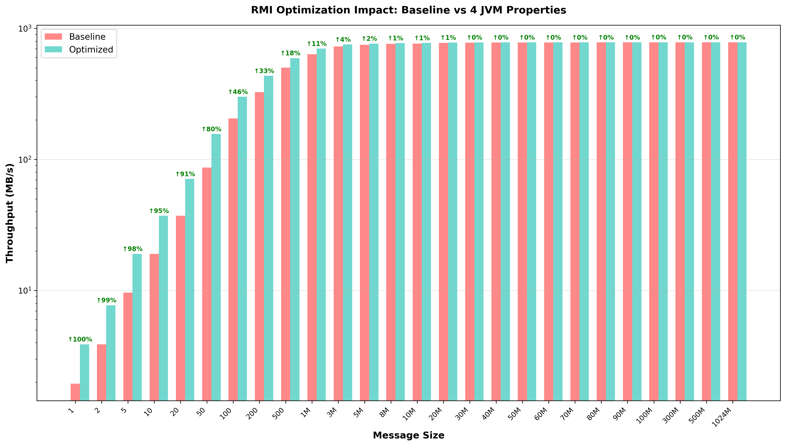

#+CAPTION: Taux d'amélioration en pourcentage pour chaque taille de message.
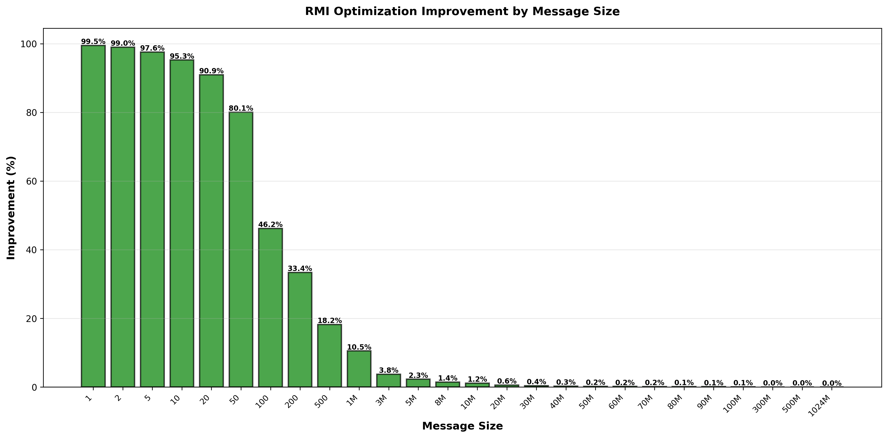

Les résultats révèlent un pattern crucial :

- *Petits messages (1-20 KB)* : amélioration *massive* (~100 % pour 1-2 KB). La sérialisation domine, et désactiver ProxyClass la réduit de moitié.
- *Gros messages (> 100 KB)* : amélioration *négligeable* (< 1 %). Le transfert réseau domine, les optimisations logicielles ne peuvent rien y faire.

* Comparaison Ethernet vs OPA (Omni-Path)
  -> COMMIT: 0388f6bbae6538d318cf27566d2b6cbe7e6b92c8  -> DATE: December 28, 2025 at 4:58 PM

** Contexte : deux réseaux sur Grid5000

Grid5000 Grenoble dispose de deux réseaux distincts :

1. *Ethernet 10 Gbps* (~172.16.x.x~) : le réseau par défaut, utilisé pour les tâches générales.
2. *Omni-Path 100 Gbps* (~172.18.x.x~) : un réseau haute performance dédié au calcul haute performance (HPC).

L'enjeu est de déterminer quel réseau offre les meilleures performances pour le PingPong et à quel prix.

** Stratégie de test

Nous avons lancé les tests PingPong sur les deux réseaux :

- mesure de la *latence* (RTT médian),
- mesure du *débit* effectif,
- comparaison avant et après optimisation RMI.

** Résultats : avant optimisation RMI

#+CAPTION: Comparaison Ethernet vs OPA avant optimisation RMI - Latence.
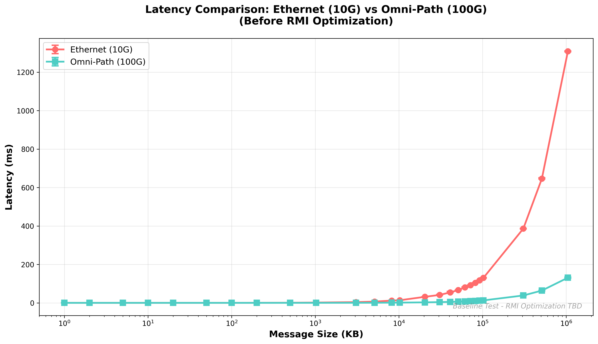

#+CAPTION: Comparaison Ethernet vs OPA avant optimisation RMI - Débit.
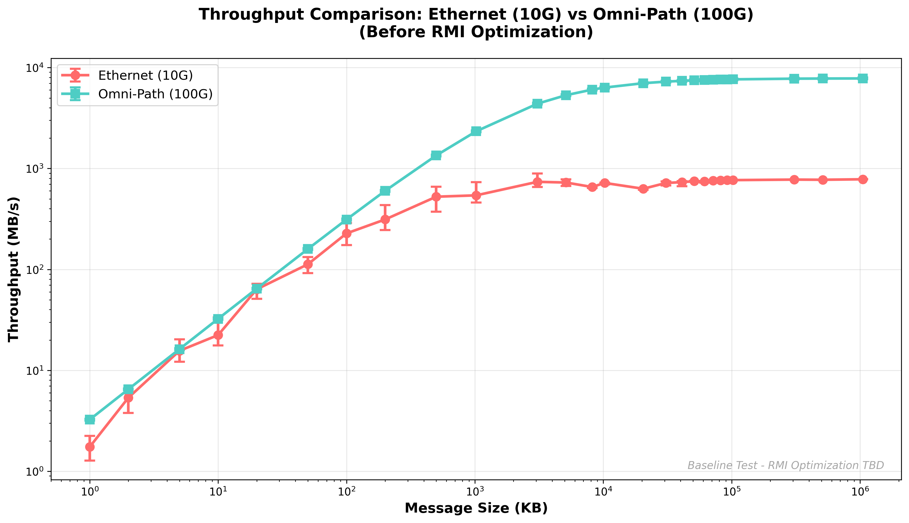

Avant optimisation :

- *Ethernet 10 Gbps* : débit observé ~780 MB/s (proche du plafond théorique),
- *OPA 100 Gbps* : débit atteint *~7800 MB/s*, soit environ *10x supérieur à Ethernet*.

Contrairement à ce qu'on aurait pu penser, l'OPA ne plafonnait donc PAS à 750 MB/s. C'est l'Ethernet qui était limité à ses 10 Gbps théoriques. L'OPA exploitait déjà bien la bande passante disponible.

** Résultats : après optimisation RMI

#+CAPTION: Comparaison Ethernet vs OPA après optimisation RMI - Latence.
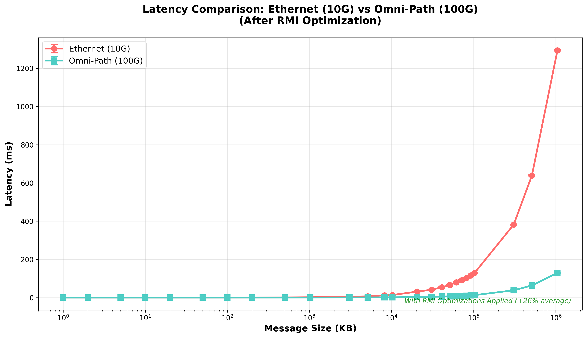

#+CAPTION: Comparaison Ethernet vs OPA après optimisation RMI - Débit.
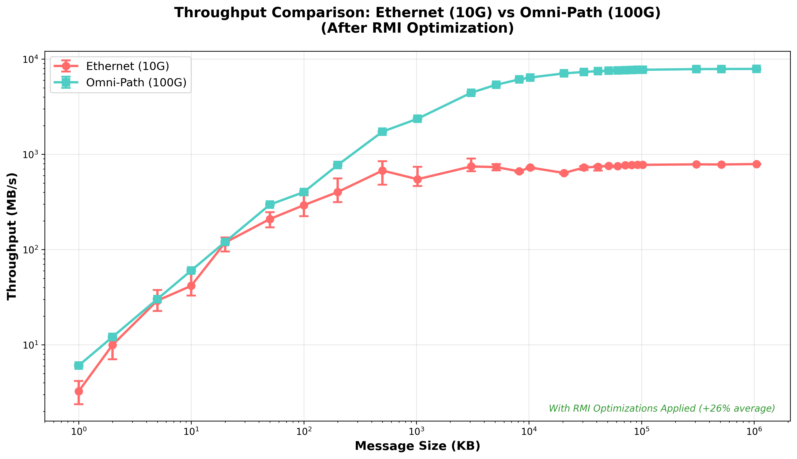

Après optimisation :

- *Ethernet 10 Gbps* : débit augmente légèrement à ~790 MB/s (amélioration mineure de ~1-2 %),
- *OPA 100 Gbps* : débit monte à *~7900 MB/s* (amélioration de ~1-2 %), soit toujours *10x plus rapide qu'Ethernet*.

La différence reste prononcée : *OPA reste 10x plus rapide qu'Ethernet* même après optimisation. Les optimisations JVM offrent des améliorations marginales dans ce contexte car le réseau physique reste le facteur dominant.

** Conclusion : explications et recommandations

1. *Deux régimes très distincts selon la taille du message* :
   
   - *Petits messages (1-20 KB) : l'optimisation RMI est CRITIQUE* :
     - À 1 KB : débit multiplié par *2* (baseline 1.95 MB/s → optimisé 3.89 MB/s, +100%)
     - À 2 KB : débit multiplié par *2* (baseline 3.89 MB/s → optimisé 7.74 MB/s, +99%)
     - À 10 KB : débit multiplié par *2* (baseline 19.06 MB/s → optimisé 37.21 MB/s, +95%)
     
     Pourquoi ? Sur ces tailles, l'overhead de *sérialisation* (proxy classes, buffers heap, GC) domine largement le temps de transfert réseau. En désactivant ProxyClass et activant DirectByteBufferPool, on divise littéralement ce coût par deux.

   - *Gros messages (> 100 KB) : l'optimisation RMI est MARGINALE* :
     - À 1 MB : débit quasi-inchangé (baseline 783.8 MB/s → optimisé 783.9 MB/s, +0.1%)
     - Amélioration globale : *1-2 %* seulement
     
     Pourquoi ? Sur ces tailles, le temps de *transfert réseau* domine absolument. La sérialisation devient négligeable. Les optimisations JVM ne peuvent rien améliorer si le réseau est le bottleneck.

2. *Choix du réseau (Ethernet vs OPA) domine pour les gros volumes* :
   
   Le réseau OPA 100 Gbps fournit un débit ~10× supérieur à Ethernet 10 Gbps, indépendamment des optimisations RMI. C'est une *différence matérielle*, pas logicielle : OPA reste 10× plus rapide même après optimisation.

3. *Recommandations pratiques* :
   
   - *Pour les applications échangeant beaucoup de petits messages* (e.g., contrôle distribué, requêtes RPC courtes) : les optimisations RMI sont *essentielles* (+100% de débit possible).
   
   - *Pour les applications de transfert de gros volumes* (e.g., traitement de données massives, streaming) : le choix du réseau physique prime absolument. Privilégiez OPA si disponible (gain ×10 vs Ethernet).
   
   - *En résumé* : 
     - Petits messages → RMI optimizations matter
     - Gros messages → Network hardware matters

* Comparaison NFS vs SCP : latence et débit
  -> COMMIT: 54ed6123ead76a2d1436e1da10d1de8ef3cae6db  -> DATE: January 1, 2026 at 1:46 PM

** Contexte 

La gestion des fichiers est un élément critique des systèmes distribués. Nous avons comparé deux approches : 
- *NFS* (Network File System) : système de fichiers réseau transparent
- *SCP* (Secure Copy Protocol) : transfert de fichiers basé sur SSH

L'objectif est d'identifier le protocole le plus efficace pour différentes tailles de fichiers.

** Latence

NFS démontre une *supériorité nette* : latence inférieure à 5 ms pour tous les fichiers testés, indépendamment de leur taille.

SCP, en revanche, souffre du *surcoût du handshake SSH* :
- Identification du serveur
- Authentification des credentials
- Ouverture du canal de transfert

Pour les *petits fichiers* (0-1 KB), ce handshake représente une fraction massive du temps total, résultant en une latence initiale jusqu'à ~380 ms qui diminue progressivement pour se stabiliser autour de ~230 ms.

** Petits fichiers (0-1 KB)

*** Latence

#+CAPTION: Latence pour les petits fichiers : NFS conserve une latence faible et stable, tandis que SCP subit une latence plus élevée et variable à cause du handshake SSH.
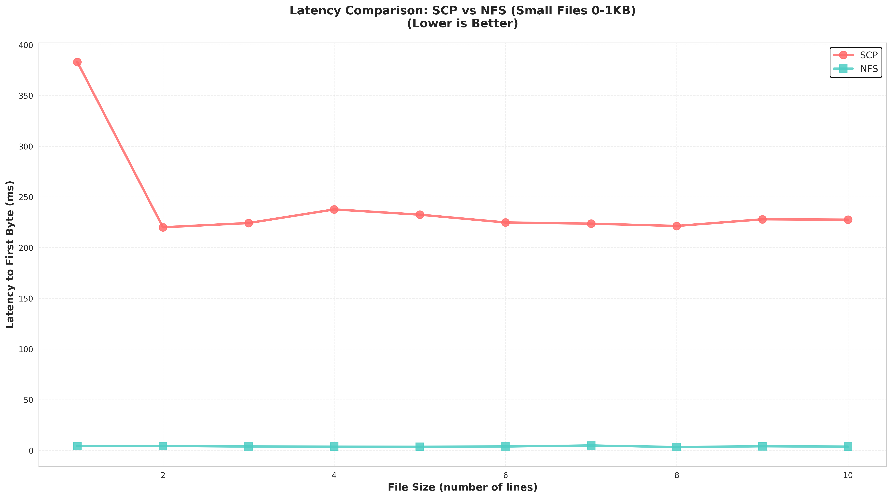

*** Débit

- *NFS* : débit constant et mesurable dès les petites tailles
- *SCP* : débit quasi-nul en raison du ratio handshake/taille dominé par l'overhead SSH

La formule explique ce phénomène :
$Débit = Taille fichier / (T_{Overhead SSH} + T_{transfert})$

#+CAPTION: Débit pour les petits fichiers : NFS surpasse significativement SCP dès les petites tailles.
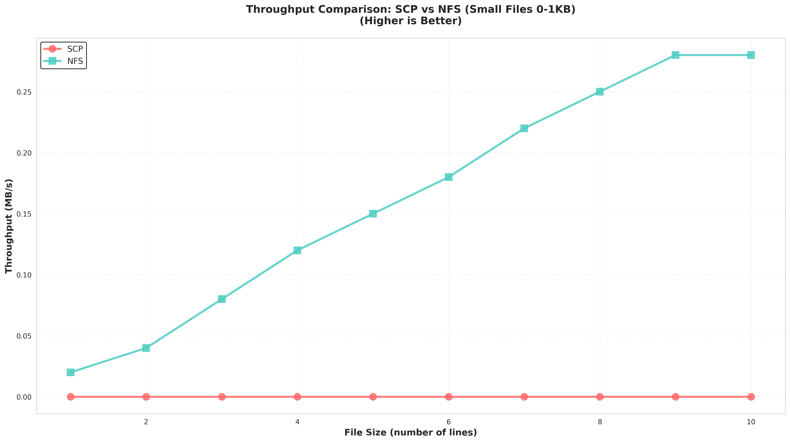

** Grands fichiers 

*** Latence

NFS maintient une latence inférieure à 5 ms indépendante de la taille du fichier.

#+CAPTION: Latence pour les grands fichiers : NFS conserve une latence minimale même pour les transferts volumineux.
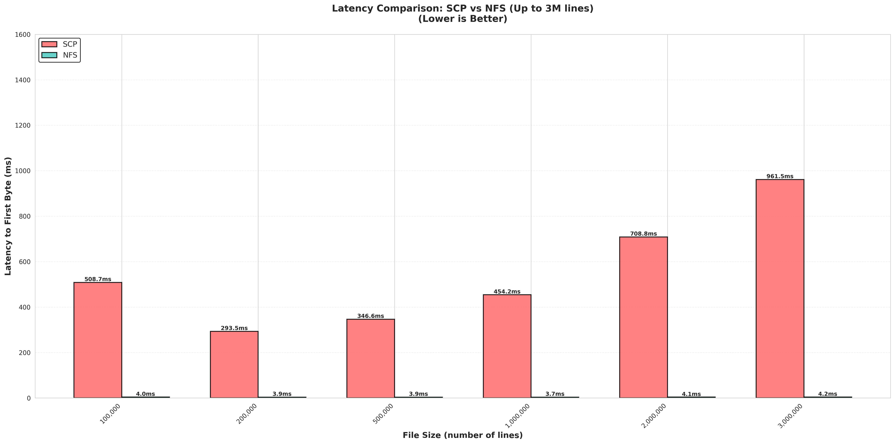

*** Débit

NFS maintient son avantage même pour les transferts volumineux : débit très élevé.

SCP reste limité par l'overhead de chiffrement SSH et le transfert réseau, même pour les gros fichiers.

#+CAPTION: Débit pour les grands fichiers : NFS conserve un débit supérieur à SCP, même pour les transferts volumineux.
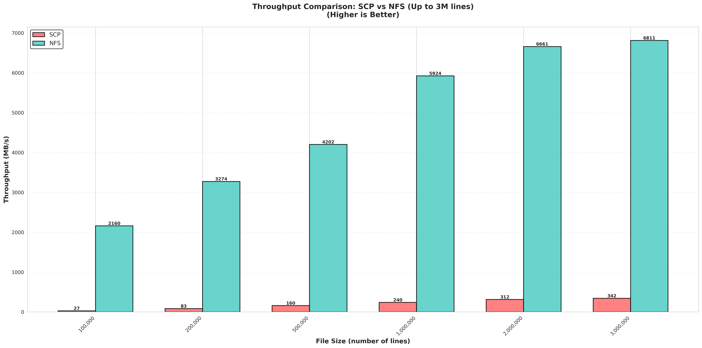

** Recommandations

- *Petits fichiers* : *NFS est indispensable*. NFS est plus performant que SCP.
- *Grands fichiers* : NFS reste préférable. Pour un système distribué haute performance, utiliser NFS comme système de fichiers partagé principal, et SCP uniquement pour des transferts sécurisés ponctuels ou en solution de secours.

** Conclusion

L'absence de handshake pour chaque opération en NFS, contrairement à SCP où chaque transfert nécessite une nouvelle session SSH établie, explique la supériorité systématique de NFS sur l'ensemble des cas de test.

* Architecture et Logique du Makefile Parallèle
-> COMMIT: 8beecca35f7c3df8b1ed051756c06c80dc93d5cb -> DATE: January 1, 2026 at 11:25 PM

** Contexte général

Le Makefile constitue l'élément central de notre projet. Il orchestre l'ensemble du workflow de traitement parallèle en définissant :
- les *dépendances* entre tâches
- l'*ordre d'exécution* optimal
- les *règles de compilation* et de traitement

La structure du Makefile repose sur un graphe de dépendances acyclique (DAG) qui permet à GNU Make de paralléliser les tâches indépendantes.

** Graphe de dépendances

 Le graphe de dépendances est le suivant :

#+CAPTION: Graphe de dépendances du Makefile parallèle : flux du traitement des partitions en parallèle et agrégation finale.
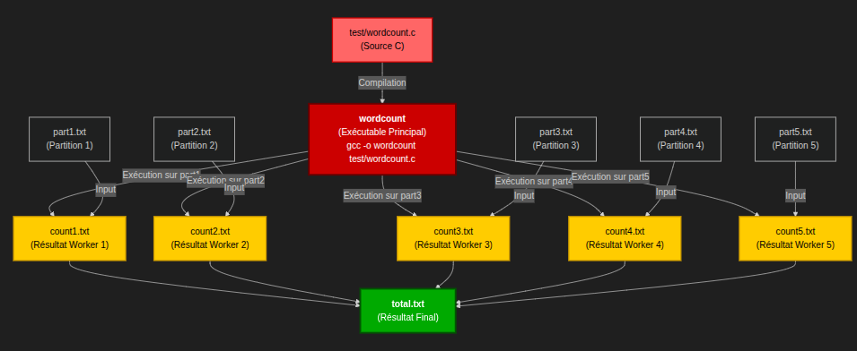

Structure conceptuelle du DAG (Directed Acyclic Graph) :

** Logique détaillée du Makefile

*** Étape 1 : Compilation du programme

wordcount: test/wordcount.c
    gcc -o wordcount test/wordcount.c

- *Cible* : wordcount (l'exécutable)
- *Dépendance* : test/wordcount.c (le source)
- *Action* : compilation avec gcc

Cette étape doit s'exécuter *une seule fois* au démarrage. 

*** Étape 2 : Traitement parallèle des N partitions

Pour un ensemble de N partitions, le Makefile génère N règles identiques :

#+BEGIN_SRC makefile
count1.txt: part1.txt wordcount
    ./wordcount part1.txt > count1.txt

count2.txt: part2.txt wordcount
    ./wordcount part2.txt > count2.txt

...

countN.txt: partN.txt wordcount
    ./wordcount partN.txt > countN.txt
#+END_SRC

- *Cibles* : count1.txt, count2.txt, ..., countN.txt
- *Dépendances* : chaque partition d'entrée (part1.txt, part2.txt, ..., partN.txt) + l'exécutable wordcount
- *Action* : exécute wordcount sur chaque partition

*** Étape 3 : Agrégation des résultats

#+BEGIN_SRC makefile
total.txt: count1.txt count2.txt ... countN.txt
    cat count1.txt count2.txt ... countN.txt | \
    awk '{sum += $1} END {print sum}' > total.txt
#+END_SRC

- *Cible* : total.txt (résultat final)
- *Dépendances* : les N fichiers de comptage (count1.txt, count2.txt, ..., countN.txt)
- *Action* : concatène les résultats et somme les valeurs avec awk

Cette étape *attend* que toutes les N partitions soient traitées, puis agrège les résultats. Elle représente la synchronisation finale du pipeline.

** Workflow complet et planification des tâches

1. *Vérification et compilation* : wordcount est compilé si nécessaire sur le nœud maître de Grid5000
2. *Distribution et parallélisation* : 
   - Les N partitions sont distribuées et traitées *en parallèle* sur les nœuds réservés
   - Chaque instance de wordcount s'exécute sur un **nœud Grid5000 différent**, traitant une partition assignée
3. *Synchronisation* : une fois tous les count1.txt, count2.txt, ..., countN.txt disponibles, l'agrégation commence
4. *Résultat final* : total.txt contient le nombre total de mots obtenu en additionnant les comptages partiels (count1.txt, count2.txt, ..., countN.txt) générés par chaque nœud

* Performances et Calibration du Modèle
      -> COMMIT: 50049e7fe0726abed4d000b0acdb1035e6f4f560 -> DATE: January 3, 2026 at 4:00 AM

** Contexte général

Cette section documente l'analyse expérimentale des performances du système distribué en fonction du nombre de workers et de la taille des données. Une campagne de mesures a été menée pour calibrer un modèle théorique capable de prédire le temps d'exécution global du makefile parallèle.

** Protocole expérimental

*** Configuration de test

- *Taille de données* : S = 1700 MB
- *Nombre d'itérations* : 10 itérations par configuration
- *Configurations testées* : n = 2, 3, 6, 8, 10, 12, 15, 18 workers
- *Infrastructure* : Grid5000 (NFS pour le partage de fichiers)

*** Phases mesurées

Pour chaque exécution du makefile parallèle, quatre phases sont instrumentées :

1. *t_init* : initialisation et communication (ms)
2. *t_split* : découpage du fichier en partitions (ms)
3. *t_calc* : calcul parallèle (traitement des partitions) (ms)
4. *t_merge* : agrégation des résultats (ms)

*Observation clé* : Au-delà de 11 workers, t_calc stagne autour de 3500-3600 ms, indiquant un point de saturation.

*** Graphiques de validation

#+CAPTION: Temps total expérimental vs. théorique : le modèle calibré prédit précisément le comportement du système pour 2 à 18 workers.
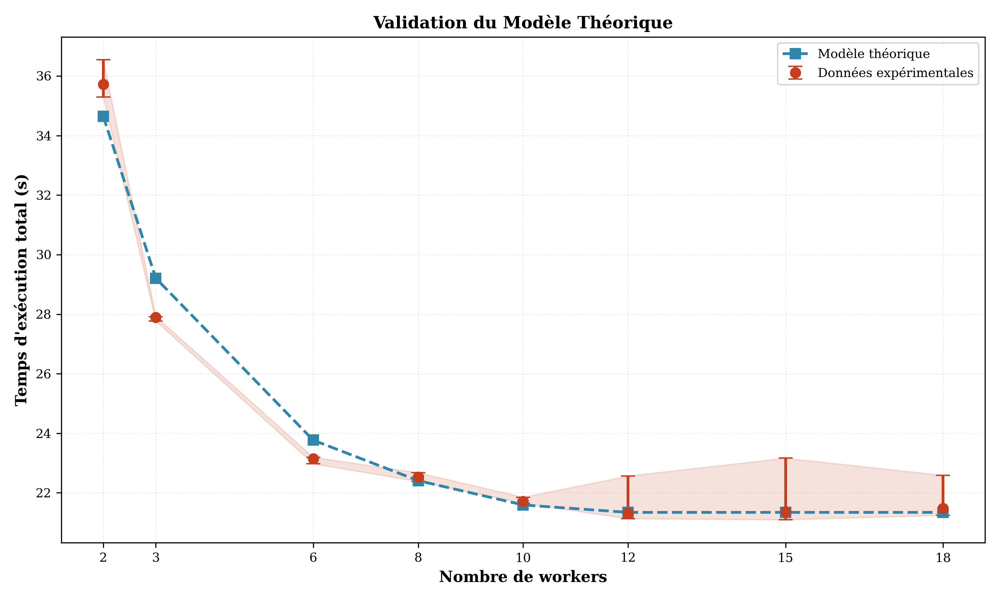
#+CAPTION: Speedup && efficiency
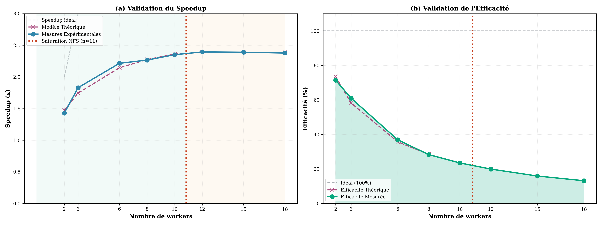

